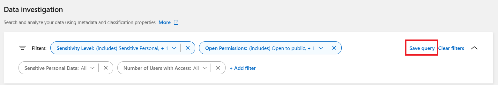

= 
:allow-uri-read: 

.Passos
. Na aba Investigação, defina uma pesquisa selecionando os filtros que deseja usar. Verlink:task-investigate-data.html["Filtrando dados na página Investigação"] para mais detalhes.
. Depois de definir todas as características do filtro conforme sua preferência, selecione *Salvar consulta*.
+

. Nomeie a consulta salva e adicione uma descrição.  O nome deve ser único.
. Opcionalmente, você pode salvar a consulta como política:
+
.. Para salvar a consulta como uma política, alterne a opção *Executar como uma política*.
.. Escolha *Excluir permanentemente* ou *Enviar atualizações por e-mail*.  Se você escolher atualizações por e-mail, poderá enviar os resultados da consulta para _todos_ os usuários do Console diariamente, semanalmente ou mensalmente.  Como alternativa, você pode enviar a notificação para um endereço de e-mail específico com a mesma frequência.

. Selecione *Salvar*.
+
image:../media/screenshot_compliance_save_highlight2.png["Uma captura de tela que mostra como configurar a consulta salva e salvá-la."]

Depois de criar a pesquisa ou política, você pode visualizá-la na aba **Consultas salvas**.
